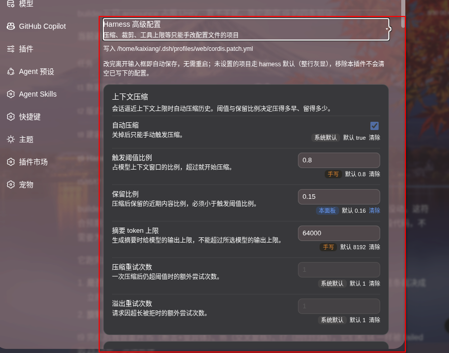

# @Tinnikx/dsh-operation-improve

DeepSeek Harness 操作增强插件。本包不发布（`private: true`），装进 profile 后加七项行为——功能 1、2 在侧边栏，功能 4、7 在会话页，功能 5 是全局配色，功能 6 在页面任意位置，功能 8 在设置页：

| | 一句话 | 设计与实测 |
| --- | --- | --- |
| **功能 1** | `ctrl`/`cmd` + 点击多选工作区行或会话行，限制同级（会话与工作区不能混选）。 | [docs/feature-1-2-sidebar-menu.md](docs/feature-1-2-sidebar-menu.md) |
| **功能 2** | 侧边栏行的右键菜单。单选逐项对齐该行原有「...」菜单（项、顺序、文案、图标、样式、动作都一样），多选只保留批量破坏性操作。 | 同上 |
| **功能 4** | 会话页逐行开始时间戳。每条回复、工具调用、思考等节点行的右上角显示它的**开始**时刻（`HH:mm:ss`），user / steering / turn-tail 三类改成常驻显示上游自己的时间标签。 | [docs/feature-4-timestamps.md](docs/feature-4-timestamps.md) |
| **功能 5** | 活跃标记（`StateDot state="ongoing"`）的配色覆盖。把上游那 8 格追逐动画的基线不透明度从 `.15` 抬到 `.6` 并换成青色，深浅主题各一个值。纯样式，不加监听。 | [docs/feature-5-active-dot.md](docs/feature-5-active-dot.md) |
| **功能 6** | 选中文本的右键菜单。页面任意位置选中一段文本后在选区上右键，弹出与功能 2 同一套外观的菜单，给「复制」；落点可输入时再给「粘贴」（可输入的空控件上即使没有选中文本也弹，只给「粘贴」）。两项都没有时不吃掉事件，原生菜单照常。 | [docs/feature-6-selection-menu.md](docs/feature-6-selection-menu.md) |
| **功能 7** | 思考区域的高度上限与滑块。展开后的思考正文超过 60vh 时截到 60vh 并出竖直滚动条，放得下的一点不变。纯样式，不加监听，配色字号行距内边距全部留给上游。 | [docs/feature-7-think-scroll.md](docs/feature-7-think-scroll.md) |
| **功能 8** | 设置页「通用设置」里的「Harness 高级配置」一行。展开后是一个精选清单面板，把只有 cordis entry config、没有 settings 命名空间的那类配置（压缩阈值、工具结果裁剪长度、ralph 轮数……）搬进界面，写回当前 profile 的 `cordis.patch.yml` 里一个托管区段。改完离开输入框即自动保存，没有保存按钮。 | [docs/feature-8-harness-config.md](docs/feature-8-harness-config.md) |

功能 1、2、6 共用的基础层（选择状态、菜单组件、行识别、词典）与调试句柄在 [docs/shared-api.md](docs/shared-api.md)，验证在 [docs/verify.md](docs/verify.md)。

## 截图

| | |
| --- | --- |
|  |
| 选中一段思考正文后在选区上右键，弹出「复制」（功能 6）；每行节点右上角是它的开始时刻（功能 4）。 |
|  |  |
| `ctrl`/`cmd` + 点击多选同级会话行（功能 1），在选中行上右键得到只剩批量破坏性操作的菜单「归档 5 个会话」（功能 2）。 | 设置页「通用设置」里展开的「Harness 高级配置」面板（功能 8）：按插件分组的卡片、三类控件与来源徽标（系统默认 / 手写 / 本面板），失焦即写回 `cordis.patch.yml`。 |

## 布局

```
src/
  index.js                     host 半边：挂功能 8 那条回环路由
  client/index.js              client 入口：插样式表、装五个功能、注册 ctx.effect 回收
  shared/
    selection-store.js         选择状态 store（同级约束）
    context-menu.js            通用右键菜单（纯 DOM）+ 样式表
    menu-icons.js              菜单图标：逐字拷自 `ui-primitives` 的内联 SVG（paste 那枚自绘）
    row-probe.js               行识别与 React fiber 反查 id / 标题
    locale.js                  菜单与设置面板的文案：借上游 `workspace` / `common` 词典 + 本插件自己的词典
  multi-select/index.js        功能 1
  context-menu-feature/index.js 功能 2
  timestamps/
    index.js                   功能 4（逐行时间戳 + 它自己的样式表）
    format-clock.js            时钟格式化纯函数（可脱离 DOM 单测）
  active-dot/index.js          功能 5（活跃标记配色，只导出一段 CSS）
  selection-menu/
    index.js                   功能 6（命中判定与菜单装配，不带样式）
    clipboard.js               功能 6 的两个动作：写剪贴板、派发 paste 事件
  think-scroll/index.js        功能 7（思考区限高 + 滑块，只导出一段 CSS）
  harness-config/              功能 8 的 host 半边
    catalog-entries.js         精选清单的收录口径与拼装点（两组条目按序拼成 `CATALOG`）
    catalog-tools.js           条目本体上半：工具与执行预算
    catalog-model.js           条目本体下半：模型请求与会话产物
    catalog-limits.js          两组共用的数值边界，镜像上游硬抛的判据
    catalog.js                 清单的查询与校验：单字段收窄 + 跨字段规则（两半共用）
    patch-file.js              托管区段的切分/渲染、YAML 标量序列化、原子落盘
    profile.js                 读 profile 三层状态（bundle / 区段外 / 生效），并把改动写回
    route.js                   `GET`/`POST` 处理与注册
    route-path.js              路由路径常量（两半共用，不 import `node:*`）
  client/settings/             功能 8 的 client 半边
    index.jsx                  slot 注册与行本体（标题 + 说明 + 展开开关）
    panel.jsx                  展开后的面板：按插件分组的卡片，失焦即自动保存
    fields.jsx                 三类控件（数字、布尔、整数列表）与来源徽标
    draft.js                   草稿 → op 列表的纯函数层（校验、脏值判定）
    api.js                     那条回环路由的两次调用
    styles.js                  功能 8 的样式（一段 CSS 字符串常量）
scripts/
  build.mjs                    esbuild 出 lib/client.js（加载器壳）与 lib/index.js
  test-stack.mjs               起/停隔离的 harness + Chrome，验证脚本的默认目标
  verify-live.mjs              对运行中的页面跑功能 1/2 的端到端断言
  verify-timestamps-live.mjs   同上，功能 4；只做编排，断言本体在 lib/ 下两个模块里
  verify-active-dot-live.mjs   同上，功能 5；截图读真实像素算对比度
  verify-selection-menu-live.mjs 同上，功能 6；走真实鼠标手势与真实剪贴板
  verify-settings-live.mjs     同上，功能 8；驱动真面板、读真 patch 文件字节、真卸载一次
  lib/cdp.mjs                  五个验证脚本共用的 CDP 连接与断言框架
  lib/ts-page.mjs              功能 4 断言的页面侧公用片段（在被测页面里求值的源码字符串）
  lib/ts-checks.mjs            功能 4 的十条断言本体
tests/
  selection-store.test.mjs     选择状态的单元测试
  format-clock.test.mjs        时钟格式化的单元测试（跨天 / 跨年分支）
  patch-file.test.mjs          托管区段写入器的字节级测试
  fixtures/web-cordis.patch.yml 真实 web profile 用户 patch 层的逐字副本，上一条的输入
docs/                          各功能的设计判据、实测读数与已知限制；验证见 verify.md
lib/                           构建产物，client bundle 是 __ModuleLoader__ 注册体
```

插件只占**一个** slot：功能 8 那一行注册在 `settings.general.item` 上。其余六项一个 slot 都不占——第五、第七两项连监听都没有，另外四项都只在既有 DOM 上加监听；视觉全部走自插的一张样式表。

- 功能 1、2 在侧边栏挂**捕获阶段**监听（要抢在 React 合成事件之前拦下 `ctrl` 点击与右键），菜单直接挂 `document.body`（`z-index: 2147483000`），高亮走 `[data-dsh-oi-selected]` 属性——不复用行自己的 `_selected` 类，那是「当前会话」的语义。
- 功能 4 只读会话页的 DOM 与 React fiber，标签作为节点行自己的子节点插入，由观察 `document.body` 的 `MutationObserver` 驱动。
- 功能 5 一行 JS 都不跑，只往那张样式表里追加几条规则；摘掉样式表即还原。
- 功能 6 同样是 `document` 上的捕获阶段 `contextmenu`，与功能 2 各自判各自的地盘（见 [docs/feature-6-selection-menu.md](docs/feature-6-selection-menu.md)），复用功能 2 那份菜单组件与样式，自己不带任何 CSS。
- 功能 7 和功能 5 一样一行 JS 都不跑，两条声明追加进同一张样式表；摘掉样式表即还原。
- 功能 8 是唯一有 host 半边的功能：client 侧只往 `settings.general.item` 注册一个组件，读写都打 host 挂在 harness 自己那个回环 HTTP 上的一条路由（见 [docs/feature-8-harness-config.md](docs/feature-8-harness-config.md)）。

## 构建

```
DSH_ESBUILD_ROOT=/home/kaixiang/dev/co-creation-project/dsh-desktop \
PATH=$HOME/.dsh/desktop-bin/node-shim:$PATH node scripts/build.mjs        # 或 npm run build
```

产物 `lib/client.js` 是 web shell 认的那层壳：`window.__ModuleLoader__.load({ id, factory })`。**注册 id 必须逐字等于 `package.json` 的 `name`，也必须等于 patch 行的 `name`**——加载器按 loader entry 的 name 认这个注册，对不上就是「loaded without registering」，页面照常 200、照常出界面，功能静默消失。

esbuild 从 `dsh-desktop` 的 pnpm store 解析（本包零运行时依赖），查找根默认取本仓库的上一级，用 `DSH_ESBUILD_ROOT` 覆盖。本仓库已经搬出 `dsh-desktop`，默认那一级下没有 store，**不带这个环境变量会直接 `esbuild not found under …` 退出**。本仓库环境里 `node` 也不在默认 PATH 上（`PATH` 前缀走 `npm run build` 时同样不能省，见[验证 · node 在哪](docs/verify.md#node-在哪)）。

功能 8 的面板是 `.jsx`，client 那次构建因此带 `jsx: 'automatic'`：它编成 `react/jsx-runtime` 的调用，而那个模块在 `EXTERNALS` 里、由加载器提供。**不能用 classic**——那会编成 `React.createElement`，而本包没有把 `React` 这个名字引进作用域。

## 加载方式

包已带 `cordis.patch.yml`，两种装法：

```
dsh plugin --profile web add github:Tinnikx/dsh-operation-improve   # 从 GitHub 装
dsh plugin --profile web add <本目录>                                # 从本地目录装（开发用）
```

`dsh plugin` 把 `add` 之后的参数**原样转发给 profile 目录里的 pnpm**，再把装上的包补进 `package.json` 的 `dsh.profile.bundles`——所以 pnpm 认的 git 写法都能用：`github:owner/repo`、`git+ssh://…`、`https://…/x.git#<tag或commit>`（`#` 后面固定版本，不写就是默认分支 `master`）。

构建产物 `lib/` 已经入库，本包也没有 `prepare` 脚本，因此不触发 pnpm 对 git 依赖的构建拦截（`dsh plugin` 装 git 包失败时提示的 `allowBuilds` 那条与本包无关）。

若手工往 `~/.dsh/profiles/web/cordis.patch.yml` 里加，需要的就是这一行：

```yaml
- insert:
    - id: dsh-operation-improve
      name: '@Tinnikx/dsh-operation-improve'
```

`name` 同时是**从 profile 目录解析的模块标识**和**客户端 bundle 的注册 id**，两处必须与 `package.json` 的 `name` 逐字相同；`id` 只是这条 loader entry 在树里的名字，不参与解析。

本仓库的开发环境里插件**已经装在 `web` profile 上**：`~/.dsh/profiles/web/package.json` 有一条 `link:<本目录>`，`node_modules/@Tinnikx/dsh-operation-improve` 是指向本仓库的符号链接。所以**页面每次加载都会自己 apply 一份实例**，注入式验证必须先把它停掉，见[验证 · 端到端](docs/verify.md#端到端)。

### 改完不用重启 harness（只对 client 半边成立）

`clientModules` 每次请求都重读一遍 bundle 文件（响应带 `cache-control: no-cache`），`client-hmr` 的 node 侧每 500ms stat 一次每份 bundle，内容变了就 `rebuilt(id)` 并从 `/plugins/events` 这条 SSE 推给浏览器侧。所以改完 client 侧代码只要重建，**跑着的 harness 进程与打开着的页面都不用动**。

实测（测试栈，harness pid 与 `/proc/<pid>` 启动时刻全程不变、页面 `performance.timeOrigin` 全程不变）：改一行源码重建后，同一条带旧 `rev` 的 bundle URL 立刻返回新内容，首页里的 `rev` 在 5 秒内自己换成新 sha，页面上插件的 `instanceId` 由 `mt9x4fif-9w6uyc` 变成 `mt9x57bp-ig3wbw`、样式表仍是 1 份——旧实例被 HMR 卸载、新实例接上，连手动刷新都不需要。

**host 半边（`lib/index.js`）不在此列**：它在 harness 启动时被加载一次，改了要 `stack:down` + `stack:up` 才生效。跑着旧 host 半边去验新行为，表现是断言对着一个已经改掉的实现报失败。

## 怎么跑验证

全部细节（node 从哪来、测试栈起什么、每个脚本的坑、各功能的断言清单）在 [docs/verify.md](docs/verify.md)。常用命令：

| 命令 | 验什么 |
| --- | --- |
| `npm test` | 单元测试：选择状态、时钟格式化、托管区段写入器（字节级） |
| `npm run stack:up` / `stack:status` / `stack:down` | 隔离测试栈：`DSH_HOME=/tmp/dsh-oi-test-home`、harness 3181、CDP 9334 |
| `npm run verify` | 功能 1、2 端到端 |
| `npm run verify:timestamps` | 功能 4 |
| `npm run verify:dot` | 功能 5 |
| `npm run verify:selection` | 功能 6 |
| `npm run verify:settings` | 功能 8（会真的往 patch 文件写字节） |

五个 `verify:*` 脚本都要先 `stack:up`，且都得带 `PATH=$HOME/.dsh/desktop-bin/node-shim:$PATH` 前缀。功能 7 没有 `npm` 脚本，判据在一份不在版本库里的 scratch 脚本中。

**验证脚本一律打测试栈，不打日常在用的那个 harness**：端到端断言里有「批量归档」「批量删除」，它们会真的发出 click。

**判据是退出码，不是屏幕上有没有红字。** 脚本把「没测到」与「测失败」同等对待：`failed + skipped > 0` 一律非零退出，环境不满足时直接 `abort()` 并点名「实测未发生」。确认真的测了只需两步：`echo $?` 为 0，且末行 summary 形如 `passed=25 failed=0 skipped=0 total=25`。

## 已知限制

每项功能的限制列在它自己那份文档的「已知限制」一节里：

- [基础层](docs/shared-api.md#已知限制)：`rowId` 的 fiber 反查依赖 React 内部字段（1 条）
- [功能 1、2](docs/feature-1-2-sidebar-menu.md#已知限制)：借上游词典键、图标与尺寸是拷贝、高亮延迟（4 条）
- [功能 4](docs/feature-4-timestamps.md#已知限制)：日期不跟随语言、九类 kind 未验证、非全局单调、类名片段、56px 留白、fiber（6 条）
- [功能 5](docs/feature-5-active-dot.md#已知限制)：结构假设、壁纸主题下管不到、色值写死（3 条）
- [功能 6](docs/feature-6-selection-menu.md#已知限制)：剪贴板权限被拒即静默失效、contenteditable 分支未验证、paste 图标自绘、落点判定的引擎回落（4 条）
- [功能 7](docs/feature-7-think-scroll.md#已知限制)：类名片段、流式思考不自动跟到底（未实测）、上限只看视口（3 条）
- [功能 8](docs/feature-8-harness-config.md#已知限制)：清单手抄、`default` 只作提示、区段必须在文件末尾、字段文案只有中文、要 `webServer`、不订阅文件变化、面板样式自写（7 条）
